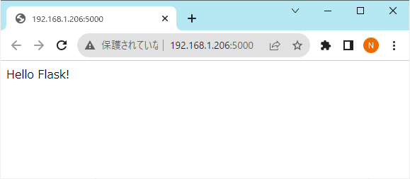
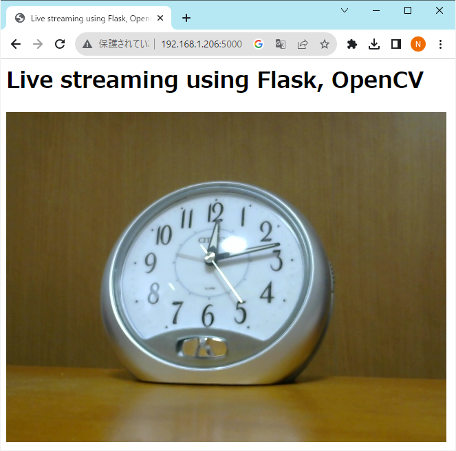

# Live streaming using Flask, OpenCV
Flask, OpenCVを使用したライブストリーミング

# 目次
* [1. 概要](#1-概要)
* [2. セットアップ](#2-セットアップ)
* [3. OpenCVを使用したカメラ画像取得の動作確認](#3-OpenCVを使用したカメラ画像取得の動作確認)
* [4. Flaskの動作確認](#4-Flaskの動作確認)
* [5. ライブストリーミング](#5-ライブストリーミング)
* [License (ライセンス)](#license-ライセンス)

# 1. 概要

* 要件
   * ウェブブラウザで簡単にWebカメラからの映像を表示できること
   * Webカメラの映像はOpenCVを使用して取得すること

* 動作確認環境  
   - Raspberry Pi 3 Model B
   - Logicool Webカメラ C270
   - Raspberry Pi OS version 11 (bullseye)
   - flask version 2.3.3
   - opencv-python version 4.8.0.76

# 2. セットアップ

1. 必要となるパッケージのインストール
   ```shell
   $ sudo apt install git -y
   $ sudo apt install python3-venv -y
   $ sudo apt install libgl1-mesa-dev -y
   ```

2. プログラムファイルのダウンロード
   ```shell
   $ git clone https://github.com/nobukihiramine/LiveStreamingUsingFlaskOpenCV
   ```

3. プログラムフォルダへ移動
   ```shell
   $ cd LiveStreamingUsingFlaskOpenCV
   ```

4. Python仮想環境の作成
   ```shell
   $ python -m venv .venv
   ```

5. Python仮想環境に入る
   ```shell
   $ source .venv/bin/activate
   ```
   参考）Python仮想環境を抜ける場合は以下のコマンドを実行する
   ```shell
   (.venv) $ deactivate
   ```

6. 必要となるPythonパッケージのインストール
   ```shell
   (.venv) $ python -m pip install -r requirements.txt
   ```

# 3. OpenCVを使用したカメラ画像取得の動作確認

1. Webカメラの接続  
   コンピューターにWebカメラを接続します。

2. 画像取得プログラムの実行  
   ```shell
   (.venv) $ python save_frame_using_opencv.py

   ```

3. 実行結果の確認  
   問題がなければ「frame.jpg」ファイルが生成され、「frame.jpg」にはカメラ画像が保存されます。

# 4. Flaskの動作確認

1. ウェブサーバープログラムの起動
   ```shell
   (.venv) $ python hello_flask.py
   ```

2. 実行結果の確認  
   ウェブブラウザで、以下のURLにアクセスします。  
   ```shell
   http://[ウェブサーバーのIPアドレスもしくはコンピュータ名]:5000
   ```
   問題がなければ、ウェブブラウザに、「Hello Flask!」と表示されます。  
   <kbd></kbd>

3. ウェブサーバープログラムの終了  
   動作を確認したら、「Ctrl + c」を押下し、起動したウェブサーバープログラムを終了します。

# 5. ライブストリーミング

1. ウェブサーバープログラムの起動
   ```shell
   (.venv) $ flask --app flask_app run --host 0.0.0.0
   ```

2. 実行結果の確認  
   ウェブブラウザで、以下のURLにアクセスします。  
   ```shell
   http://[ウェブサーバーのIPアドレスもしくはコンピュータ名]:5000
   ```
   問題がなければ、ウェブブラウザに、Webカメラからの映像が表示されます。
   <kbd></kbd>

3. ウェブサーバープログラムの終了  
   動作を確認したら、「Ctrl + c」を押下し、起動したウェブサーバープログラムを終了します。

# License (ライセンス)
Copyright 2023 Nobuki HIRAMINE  
The source is licensed under the Apache License, Version 2.0.  
"Source" form shall mean the preferred form for making modifications, including but not limited to software source code, documentation source, and configuration files.  
See the [LICENSE](LICENSE) file for more details.   
(ソースのライセンスは、「Apache License, Version 2.0」です。  
「ソース」という用語は、変更を加えるのに都合の良い形式を指し、「ソース」にはソフトウェアのソースコード、ドキュメントのソース、設定ファイルなどが含まれますが、これに限定されるものではありません。  
詳細は「[LICENSE](LICENSE)」ファイルを参照ください。)
